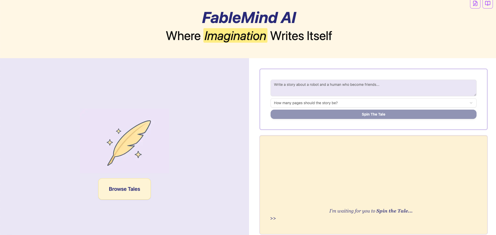

# FableMind AI 🌟✨

> Where Imagination Writes Itself



## 🧙‍♂️ About

FableMind AI is a magical children's book generation platform that leverages AI to create personalized storybooks complete with illustrations. Simply provide a prompt, and watch as FableMind spins tales of wonder, creating both text and accompanying imagery that brings the stories to life.

### ✨ Key Features

- **AI-Powered Story Generation**: Create unique children's stories from simple prompts
- **Automatic Illustration Creation**: Generate matching illustrations for each page
- **Multi-Page Stories**: Choose the length of your stories (1-10 pages)
- **Browse Collection**: Explore all previously created stories
- **Real-Time Creation**: Watch as the AI crafts your story in real-time, with transparent processing

## 🚀 Technology Stack

FableMind AI is built using modern web technologies:

### Frontend
- **React 19**: Uses the latest React features for a responsive UI
- **Next.js 15**: For server-side rendering, routing, and API endpoints
- **TailwindCSS**: For beautiful, responsive styling
- **Radix UI**: Accessible UI components that integrate with Tailwind

### Backend
- **GPTScript**: Powers the AI story generation engine
- **Next.js API Routes**: Handles API calls and server-side logic
- **Sharp**: For image processing and SVG to PNG conversion

### AI & Generation
- **GPT Models**: For creative storytelling and character development
- **Custom GPTScript Tools**: For specialized story formatting and illustration prompting
- **Event Streaming**: Real-time feedback during story generation process

## 🛠️ Getting Started

### Prerequisites
- Node.js 18.x or higher
- npm or yarn

### Installation

1. Clone the repository
   ```bash
   git clone https://github.com/yourusername/fablemind-ai.git
   cd fablemind-ai
   ```

2. Install dependencies
   ```bash
   npm install
   # or
   yarn install
   ```

3. Start the development server
   ```bash
   npm run dev
   # or
   yarn dev
   ```

4. Open your browser and navigate to `http://localhost:3000`

## 📖 Usage

1. **Create a Story**:
   - Enter a story prompt in the text area (e.g., "Write a story about a rabbit who finds a magic carrot")
   - Select the number of pages (1-10)
   - Click "Spin The Tale" to generate your story

2. **Browse Stories**:
   - Click on "Browse Tales" to view all previously generated stories
   - Select a story to read it in full with illustrations

## 🧠 How It Works

FableMind AI uses a sophisticated pipeline for story generation:

1. **Story Request**: Your prompt is sent to our GPTScript-powered story writer
2. **Content Creation**: The AI crafts a multi-page story with character descriptions and scene setting
3. **Directory Creation**: A folder structure is established for your story assets
4. **Text Generation**: Each page of text is written and saved as individual files
5. **Illustration Creation**: Custom images are generated based on the story content
6. **Presentation**: The completed story is served back to you with text and matching illustrations

## 📚 Project Structure

```
fablemind-ai/
├── app/                  # Next.js app directory
│   ├── api/              # API routes
│   │   └── run-script/   # GPTScript execution endpoints
│   └── stories/          # Story browsing pages
├── components/           # React components
│   ├── StoryWriter.tsx   # Main story creation component
│   └── ui/               # UI component library
├── lib/                  # Utility functions
├── public/               # Static assets
│   └── stories/          # Generated story content
└── images/               # Screenshots and images
```

## 🔮 Future Features

- **Voice Narration**: Text-to-speech for story reading
- **Interactive Elements**: Add interactive parts to stories
- **Custom Characters**: Let users specify their own characters
- **Export Options**: PDF and ebook export functionality
- **Personalization**: Include the child's name and preferences in stories

## 🌐 Contributing

Contributions are welcome! Please feel free to submit a Pull Request or open an Issue to improve FableMind AI.

## 📜 License

This project is licensed under the MIT License - see the LICENSE file for details.

---

Created with ❤️ and a bit of magical AI dust ✨
